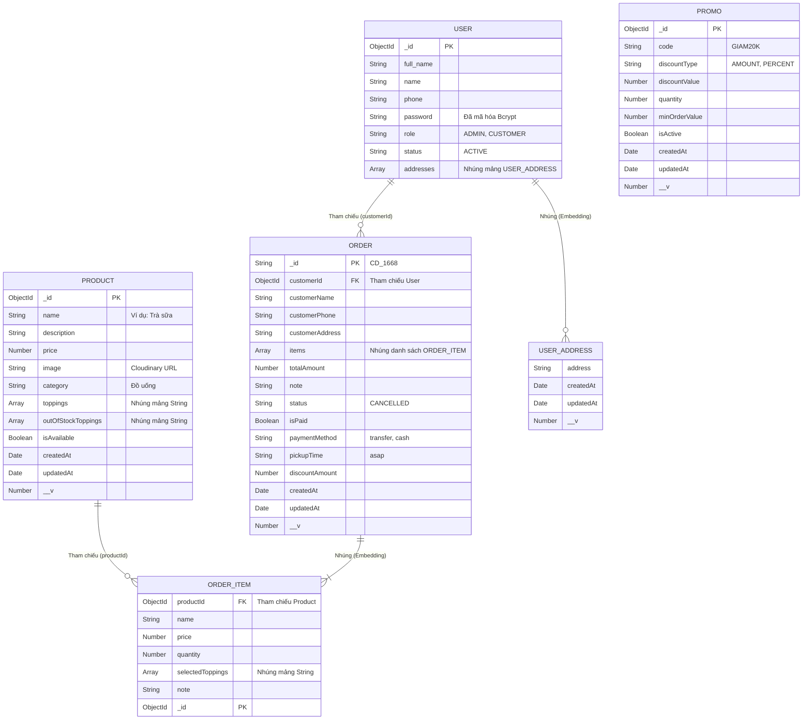

Phần 1: Giới thiệu I. Lý do chọn đề tài Trong bối cảnh chuyển đổi số mạnh mẽ hiện nay, ngành F&B đang chuyển dịch từ quy trình quản lý thủ công sang các hệ thống tự động hóa nhằm tối ưu hiệu quả kinh doanh. Đối với các mô hình cửa hàng ăn uống quy mô nhỏ, việc tối ưu hóa nguồn lực nhân sự và tốc độ phục vụ là một yếu tố sống còn. Đặc biệt, với những mô hình cửa hàng hoạt động theo cơ chế "Mang về" (Takeaway) – như mô hình cửa hàng kinh doanh cơm rang và đồ uống của nhóm – việc kiểm soát luồng đơn hàng liên tục mà không gây ách tắc tại quầy là vô cùng quan trọng. Tuy nhiên, nhiều cửa hàng nhỏ hiện nay vẫn gặp khó khăn trong việc: Dễ sai sót khi đông khách: Việc ghi nhận đơn hàng (chọn món, ghi chú không hành/thêm cơm...) bằng giấy viết tay hoặc truyền miệng dễ dẫn đến nhầm lẫn. Thiếu đồng bộ: Không có sự liên kết thời gian thực giữa Bếp và Thu ngân, dẫn đến việc lên món chậm, khách phải chờ đợi lâu. Quản lý tài chính thủ công: Khó khăn trong việc thống kê doanh thu, khó nắm bắt chính xác món ăn nào đang bán chạy để nhập nguyên liệu phù hợp. Xuất phát từ thực tế đó, cùng với mong muốn áp dụng các kiến thức đã học về lập trình web hiện đại, nhóm chúng em quyết định thực hiện đề tài: "Xây dựng hệ thống website đặt món và quản lý cửa hàng cơm rang mô hình Take-away". Đề tài lựa chọn hệ sinh thái công nghệ hiện đại với ReactJS (sử dụng TypeScript, framework UmiJS và Ant Design) cho Frontend và Node.js (Express.js, kết nối cơ sở dữ liệu MongoDB) cho Backend, hướng tới việc số hóa quy trình từ lúc khách hàng chủ động chọn món, nhân viên Bếp tiếp nhận, cho đến khi khách nhận đồ và hoàn tất đối soát thanh toán chuyển khoản trên hệ thống. II. Mục tiêu

-         Mục tiêu cốt lõi: Xây dựng thành công một Web Application chuyên biệt, giải quyết triệt để bài toán vận hành của mô hình cửa hàng Takeaway (Mang về/Giao hàng). Số hóa toàn bộ quy trình, đảm bảo luồng thông tin thông suốt và chính xác tuyệt đối từ Khách hàng đến Nhân viên.
-         Đối với Khách hàng: Nâng tầm trải nghiệm người dùng bằng giao diện web hiện đại, mượt mà (tích hợp các hiệu ứng vi chuyển động và tối ưu hóa UX). Cho phép khách hàng chủ động thao tác từ A đến Z: cá nhân hóa món ăn (chọn topping, thêm ghi chú), quản lý sổ địa chỉ giao nhận qua Google Maps, áp dụng mã khuyến mãi, lựa chọn hẹn giờ nhận đồ và thanh toán trực tuyến thông qua quét mã QR tĩnh. Cung cấp khả năng theo dõi tiến trình đơn hàng theo thời gian thực (kèm đồng hồ đếm ngược chờ phía quán xác nhận), xem lại lịch sử đơn, đánh giá dịch vụ và thao tác "Đặt lại đơn này" vô cùng tiện lợi.
-         Đối với Nhân viên (Staff): Xây dựng bộ công cụ vận hành chuyên biệt giúp loại bỏ sai sót và giảm tải áp lực giờ cao điểm. Cung cấp giao diện Bảng điều phối đơn hàng (Kanban Board) trực quan để theo dõi và cập nhật trạng thái đơn (Chờ duyệt -> Đang nấu -> Sẵn sàng -> Hoàn thành). Hỗ trợ xử lý nghiệp vụ khép kín: nhận thông báo đơn mới tức thời, đối soát thanh toán chuyển khoản, xử lý hủy đơn (kèm lý do chi tiết), in và in lại hóa đơn nhiệt, cùng với tính năng quản lý tồn kho cấp tốc (bật/tắt trạng thái món ăn/topping ngay trên giao diện) mà không cần phụ thuộc vào Admin.
-         Đối với Quản trị viên (Admin): Số hóa toàn diện công tác quản lý và phân tích kinh doanh. Cung cấp Dashboard quản trị tập trung, cho phép Admin toàn quyền kiểm soát danh mục thực đơn (tích hợp lưu trữ ảnh đám mây Cloudinary), phát hành và quản lý giới hạn mã giảm giá, kiểm soát phân quyền (cấp phát tài khoản nhân sự, khóa/mở khóa tài khoản khách hàng). Đặc biệt, hệ thống hỗ trợ ra quyết định thông qua "Trợ lý kinh doanh thông minh", tự động tổng hợp số liệu, thống kê top món bán chạy, xuất báo cáo dữ liệu đơn hàng ra file Excel/CSV, và cung cấp biểu đồ phân tích sâu, trực quan hơn về hiệu quả kinh doanh của cửa hàng.
  Phần 2: Phân tích nghiệp vụ I. BRD (Business Requirements Document)

1. Tóm tắt dự án (Executive Summary) Dự án xây dựng hệ thống quản lý cho cửa hàng cơm rang và đồ uống với mô hình kinh doanh đặc thù: Chỉ bán mang về (Take-away). Khách hàng thực hiện đặt món và thanh toán qua hệ thống (chuyển khoản quét mã QR), sau đó đến lấy hàng trực tiếp hoặc chờ quán giao hàng. Hệ thống loại bỏ hoàn toàn các chức năng đặt bàn và phục vụ tại chỗ để tối ưu hóa diện tích và nguồn lực.
2. Nhu cầu & Vấn đề (Business Need / Problem Statement)

-         Vào các khung giờ cao điểm, việc ghi nhận đơn hàng thủ công dễ dẫn đến sai sót (nhầm món, quên ghi chú của khách) và gây quá tải cho bộ phận nhận order.
-         Khách hàng muốn sự chủ động trong việc xem thực đơn, chọn món và đặt hàng trước để không phải xếp hàng chờ đợi lâu tại quán.
-         Thiếu sự đồng bộ thông tin thời gian thực giữa quầy nhận đơn và Bếp, dẫn đến tình trạng làm món chậm trễ hoặc lộn xộn thứ tự ưu tiên giữa các đơn.
-         Giải pháp: Xây dựng hệ thống web cho phép khách hàng tự thao tác (chọn món, đặt hàng trước) và nhân viên chỉ tập trung vào khâu vận hành cốt lõi(tiếp nhận, chế biến, đóng gói và đối soát thanh toán).

3. Mục tiêu nghiệp vụ (Business Objectives)

-         Chính xác và Nhanh chóng: Đảm bảo 100% luồng đơn hàng từ khách đến Bếp được đồng bộ ngay lập tức, không sai sót thông tin món ăn và ghi chú.
-         Tối ưu hóa thanh toán: Hỗ trợ luồng thanh toán qua mã QR tĩnh trực tiếp trên hệ thống với thao tác xác nhận "Đã thanh toán" nhanh gọn từ nhân viên.
-         Quản lý tập trung: Admin nắm bắt được chính xác toàn bộ doanh thu, tình trạng tồn kho (Còn hàng/Hết hàng) và hiệu quả kinh doanh qua các báo cáo thống kê.

4. Phạm vi dự án (Project Scope) A. Trong phạm vi dự án (In Scope)

-         Guest (Khách vãng lai): Khám phá trang chủ, tìm kiếm/lọc món ăn, xem chi tiết món ăn, đăng ký và khôi phục tài khoản.
-         User (Khách hàng): Quản lý giỏ hàng (tùy chỉnh topping, ghi chú), quản lý sổ địa chỉ (tích hợp Google Maps), áp dụng mã khuyến mãi (Voucher), chọn thời gian nhận hàng (giao ngay/hẹn giờ). Theo dõi trạng thái đơn hàng thời gian thực, đánh giá dịch vụ, và đặt lại đơn cũ (Re-order).
-         Nhân viên (Staff): Quản lý luồng đơn hàng theo mô hình Kanban (kéo-thả trạng thái), xác nhận thanh toán, in/in lại hóa đơn nhiệt (Thermal Bill), hủy đơn kèm lý do, quản lý tồn kho nhanh (Bật/tắt trạng thái món).
-         Quản trị viên (Admin): Quản lý tài khoản (cấp phát, khóa/mở khóa), quản lý thực đơn (CRUD món ăn, danh mục), quản lý mã khuyến mãi, quản lý toàn bộ đơn hàng (xuất file Excel/CSV). Xem báo cáo thống kê chuyên sâu với biểu đồ (Pie Chart, doanh thu) và trợ lý kinh doanh thông minh.

B. Ngoài phạm vi dự án (Out of Scope) Để tập trung vào quy trình lõi, hệ thống phiên bản hiện tại tạm thời không bao gồm các tính năng sau:

-         Đặt bàn phục vụ tại chỗ (Dine-in): Mô hình hệ thống là Take-away/Giao hàng nên không quản lý sơ đồ bàn tiệc.
-         Cổng thanh toán tự động (Payment Gateway): Hệ thống đang sử dụng luồng thanh toán qua mã QR tĩnh (chuyển khoản) và được đối soát chủ động bởi Nhân viên, chưa tích hợp tự động qua các ví điện tử trung gian (như MoMo, VNPay).
-         Ứng dụng và Định vị cho Shipper: Chưa có phân hệ tài khoản riêng biệt cho Shipper và chưa hỗ trợ theo dõi vị trí giao hàng theo thời gian thực (GPS Tracking).
-         Chăm sóc khách hàng trực tuyến (Live Chat): Chưa tích hợp kênh nhắn tin trực tiếp giữa khách hàng và quán trên nền tảng web.
-         Thắt chặt bảo mật tài khoản Quản trị (Root Admin): Để thuận tiện cho việc demo và chấm đồ án, hệ thống hiện tại vẫn mở tính năng cho phép tự đăng ký tài khoản Admin trên giao diện. Việc khóa hoàn toàn luồng đăng ký Admin (chỉ cho phép khởi tạo từ cơ sở dữ liệu) sẽ được xem như một tính năng phát triển bảo mật trong tương lai.

5. Các bên liên quan (Stakeholders)

-         Khách vãng lai (Guest): Khách truy cập ẩn danh, có nhu cầu tham khảo thực đơn trước khi quyết định đăng ký tài khoản.
-         Khách hàng (User): Người trực tiếp sử dụng dịch vụ để đặt món, thanh toán và theo dõi đơn hàng mang về.
-         Nhân viên (Staff): Vận hành quy trình tiếp nhận đơn, theo dõi, quản lý trạng thái đơn và xác nhận thanh toán chuyển khoản của khách.
-         Quản trị viên (Admin): Chủ cửa hàng, người quản lý toàn bộ dữ liệu hệ thống, thực đơn, khuyến mãi và nhân sự.
  II. SRS (Software Requirements Specification)

1. Giới thiệu Hệ thống được thiết kế theo mô hình Client-Server sử dụng các công nghệ hiện đại (ReactJS, TypeScript cho Frontend và Node.js, Express.js cho Backend) kết hợp giải pháp lưu trữ hình ảnh đám mây Cloudinary. Hệ thống tích hợp cơ chế xác thực nội bộ qua JSON Web Token (JWT) và quản lý luồng thanh toán qua mã QR chuyển khoản tĩnh với quy trình đối soát trực tiếp từ phía Nhân viên.
2. Mô tả Tổng quan 2.1. Phân quyền và đối tượng sử dụng

-         Guest (Tài khoản chưa đăng nhập): Có quyền xem trang chủ, tìm kiếm và lọc thực đơn. Giao diện được tối ưu hóa với hiệu ứng sinh động. Không có quyền thêm vào giỏ hàng hay đặt món (tự động chuyển hướng đăng nhập khi cố truy cập).
-         User (Khách hàng với tài khoản đã đăng nhập): Sở hữu các quyền của Guest, kèm thêm chức năng quản lý giỏ hàng thông minh (tách món, thêm ghi chú). Tích hợp chọn địa chỉ giao hàng qua Google Maps, áp dụng Voucher, theo dõi trạng thái đơn hàng Real-time, đánh giá đơn hàng và thao tác quản lý hồ sơ cá nhân (sổ địa chỉ đa dạng).
-         Staff (Nhân viên): Sử dụng bảng điều phối đơn hàng (Kanban Board) trực quan. Có quyền tiếp nhận đơn, cập nhật trạng thái (Chờ duyệt -> Đang nấu -> Chờ lấy -> Hoàn thành), xử lý thanh toán, in hóa đơn nhiệt. Đồng thời có công cụ quản lý tồn kho nhanh (Quick Inventory) bật/tắt món ngay trên giao diện mà không cần vào phụ thuộc Admin.
-         Admin (Quản trị viên): Nắm toàn quyền hệ thống. Quản lý danh mục/món ăn (tích hợp lưu trữ ảnh Cloudinary), quản lý mã khuyến mãi, quản lý toàn bộ đơn hàng (hỗ trợ xuất file Excel/CSV), và kiểm soát trạng thái người dùng/nhân viên (chỉ Admin mới có quyền sửa/xóa tài khoản). Truy cập Dashboard thống kê doanh thu, biểu đồ tỷ lệ hủy đơn và trợ lý phân tích dữ liệu kinh doanh.
  2.2. Yêu cầu xác thực (Authentication & Authorization)
-         Cơ chế chính: Sử dụng xác thực nội bộ bằng JWT (JSON Web Token) kết hợp phân quyền Role-based (Guest, User, Staff, Admin). Mỗi khi đăng nhập thành công, Backend (Node.js) sẽ cấp một Token có thời hạn để Frontend (ReactJS) sử dụng cho các thao tác gọi API bảo mật tiếp theo.
-         Đối với Khách hàng (User): Khách hàng tự do đăng ký tài khoản bằng thông tin cơ bản (Họ tên, Tên đăng nhập, Số điện thoại, Mật khẩu). Việc đăng nhập được thực hiện qua số điện thoại/tên đăng nhập và mật khẩu. Mật khẩu được mã hóa một chiều an toàn bằng thư viện Bcrypt trước khi lưu vào Cơ sở dữ liệu (MongoDB).
-         Đối với Nhân viên (Staff): Tuyệt đối không có tính năng tự đăng ký để tránh rò rỉ dữ liệu. Tài khoản của Staff sẽ do trực tiếp Admin tạo và cấp phát. Nhân viên sử dụng tài khoản này để đăng nhập vào cổng quản trị nội bộ.
-         Đối với Quản trị viên (Admin): Admin có thể tự đăng ký tài khoản trực tiếp qua tab "Đăng ký Admin" tại cổng quản trị nội bộ. Sau khi đăng nhập, JWT sẽ được cấp với mã phân quyền cao nhất, cho phép can thiệp vào toàn bộ cấu hình, người dùng và dữ liệu của hệ thống.

3. Yêu cầu Phi chức năng (Non-Functional Requirements)

-         Bảo mật: Phân quyền đa tầng cực kỳ nghiêm ngặt (Admin/Staff/User). Mật khẩu mã hóa một chiều an toàn bằng Bcrypt. Hệ thống áp dụng cơ chế Bảo vệ đường dẫn (Protected Routes) kết hợp với token JWT để ngăn chặn hoàn toàn việc truy cập trái phép hoặc leo thang đặc quyền.
-         Giao diện (UI/UX): Thiết kế Premium hiện đại. Tích hợp chuỗi hiệu ứng vi chuyển động (Micro-animations) nhằm tối ưu trải nghiệm người dùng: hiệu ứng chuyển cảnh SVG sắc nét khi đăng nhập, thức ăn bay vào giỏ (Fly-to-cart), và viền sáng cảnh báo (Running-border glow) cho đơn hàng mới của Staff. Hỗ trợ cuộn mượt (Auto-scroll) và phản hồi tức thì qua Toast Notifications.
-         Hiệu năng & Thời gian thực (Real-time): Tích hợp đồng hồ đếm ngược vòng đời đơn hàng. Sử dụng kỹ thuật Debounce Search để chống spam gọi API khi tìm kiếm và cơ chế Preload Chunk của UmiJS giúp tăng tốc độ tải trang, triệt tiêu độ trễ chuyển trang, đảm bảo web chịu tải tốt trong giờ cao điểm.
-         Tính toàn vẹn dữ liệu: Ứng dụng cơ chế Snapshot (Lưu ảnh chụp dữ liệu). Giá món ăn và giá trị Voucher tại thời điểm đặt hàng được lưu cứng vào chi tiết đơn, đảm bảo hóa đơn không bị sai lệch kể cả khi Admin thay đổi giá món ăn trong tương lai. Các thao tác hủy đơn bắt buộc lưu vết lý do để phục vụ hậu kiểm.

Phần 3: Phân công nhiệm vụ (Team Roles & Responsibilities) Dựa trên kiến trúc hệ thống và 4 nhánh phát triển, công việc được phân công cụ thể như sau:

1. Nam (Xác thực & Quản trị hệ thống):

- Phát triển luồng Đăng nhập/Đăng ký, bảo mật JWT và cơ chế Phân quyền đa tầng (Protected Routes).
- Xây dựng Admin Dashboard với các biểu đồ thống kê cao cấp và quản trị tài khoản người dùng/nhân viên.
- Phát triển phân hệ Quản lý đơn hàng tổng cho Admin (hỗ trợ xuất báo cáo Excel/CSV) và Trợ lý phân tích dữ liệu kinh doanh.

2. Minh (Luồng Giỏ hàng & Điều phối đơn):

- Xử lý logic Giỏ hàng thông minh (tùy chỉnh topping, tách món) và luồng thanh toán chuyển khoản qua mã QR tĩnh.
- Phát triển giao diện Kanban Board cho Nhân viên kéo thả trạng thái đơn theo thời gian thực và thực hiện đối soát thanh toán.
- Tích hợp in hóa đơn nhiệt (Thermal Bill) và chức năng Quick Inventory (Bật/tắt nhanh tình trạng còn/hết hàng).

3. Long (Giao diện Khách & Bản đồ):

- Thiết kế giao diện Khách hàng hiện đại, xây dựng tính năng Khám phá thực đơn tích hợp thuật toán tìm kiếm (Debounce Search).
- Cấu hình Sổ địa chỉ và tích hợp API Google Maps để ghim vị trí nhận hàng, tự động chuyển đổi tọa độ thành địa chỉ.
- Nghiên cứu và áp dụng chuỗi hiệu ứng vi chuyển động (Micro-animations: Fly-to-cart, SVG Loading, Running-border glow).

4. Khánh (Sản phẩm, Khuyến mãi & Lịch sử):

- Xây dựng luồng Quản trị danh mục và thực đơn (CRUD) cho Admin, tích hợp Cloudinary lưu trữ ảnh đám mây.
- Lập trình hệ thống quản lý Mã giảm giá (Voucher) tự động kiểm tra điều kiện áp dụng và đối soát.
- Xây dựng trang Lịch sử đơn hàng cho khách với các tiện ích mở rộng: Hủy đơn, Đánh giá dịch vụ và Đặt lại đơn cũ (Re-order).

Phần 4: Thiết kế Cơ sở dữ liệu (Database Design) Với đặc thù là hệ thống quản lý đơn hàng theo thời gian thực (Take-away/Giao hàng), dự án lựa chọn hệ quản trị CSDL NoSQL MongoDB. Thay vì sử dụng Mô hình thực thể liên kết (ERD) truyền thống của SQL, dữ liệu được tổ chức theo Sơ đồ cấu trúc tài liệu (Document Data Model).

4.1. Sơ đồ Cấu trúc Tài liệu (Document Data Model) Sơ đồ dưới đây mô tả cấu trúc các Collection, thể hiện rõ 2 cơ chế đặc thù của MongoDB: Nhúng mảng (Embedding) và Tham chiếu (Referencing).



4.2. Thiết kế Schema Chi tiết (Data Modeling) Trong MongoDB, dữ liệu không bị gò bó bởi cấu trúc bảng mà được thiết kế linh hoạt dưới dạng BSON/JSON. Dưới đây là kiến trúc chi tiết cho từng Collection trong hệ thống:

### 1. Collection: `users`

**Cấu trúc JSON mẫu:**

```json
{
  "_id": ObjectId("647a8b9c..."),
  "full_name": "Nguyễn Văn A",
  "name": "nguyenvana",
  "phone": "0987654321",
  "password": "$2b$10$hashedpassword...",
  "role": "CUSTOMER",
  "status": "ACTIVE",
  "addresses": [
    {
      "address": "123 Đường ABC, Quận X, TP.HCM",
      "createdAt": "2023-06-01T10:00:00Z",
      "updatedAt": "2023-06-01T10:00:00Z",
      "__v": 0
    }
  ],
  "createdAt": "2023-06-01T10:00:00Z",
  "updatedAt": "2023-06-01T10:00:00Z",
  "__v": 0
}
```

**Bảng giải thích các trường:** | Tên trường (Field) | Kiểu dữ liệu (MongoDB Type) | Mô tả / Ý nghĩa | Ghi chú | | :--- | :--- | :--- | :--- | | `_id` | ObjectId | Mã định danh duy nhất | Tự động sinh bởi MongoDB, Khóa chính | | `full_name` | String | Họ và tên đầy đủ | Required | | `name` | String | Tên đăng nhập (Username) | Unique, Required | | `phone` | String | Số điện thoại đăng nhập | Unique, Required | | `password` | String | Mật khẩu tài khoản | Đã mã hóa Bcrypt một chiều | | `role` | String | Quyền hạn tài khoản | Mặc định: "CUSTOMER" (Có thể là "ADMIN") | | `status` | String | Trạng thái hoạt động | Mặc định: "ACTIVE" | | `addresses` | Array (Object) | Danh sách địa chỉ nhận hàng | Embedded Document (Nhúng trực tiếp) | | `createdAt`, `updatedAt` | Date | Thời gian tạo và cập nhật | Tự sinh nhờ tùy chọn timestamps của Mongoose |

### 2. Collection: `products`

**Cấu trúc JSON mẫu:**

```json
{
  "_id": ObjectId("647b1c2d..."),
  "name": "Trà sữa trân châu",
  "description": "Trà sữa vị truyền thống",
  "price": 25000,
  "image": "https://res.cloudinary.com/.../trasua.jpg",
  "category": "Đồ uống",
  "toppings": ["Trân châu đen", "Thạch trái cây"],
  "outOfStockToppings": [],
  "isAvailable": true,
  "createdAt": "2023-06-02T08:30:00Z",
  "updatedAt": "2023-06-02T08:30:00Z",
  "__v": 0
}
```

**Bảng giải thích các trường:** | Tên trường (Field) | Kiểu dữ liệu (MongoDB Type) | Mô tả / Ý nghĩa | Ghi chú | | :--- | :--- | :--- | :--- | | `_id` | ObjectId | Mã định danh duy nhất | Tự động sinh bởi MongoDB, Khóa chính | | `name` | String | Tên món ăn / đồ uống | Required | | `description` | String | Mô tả chi tiết món ăn | Optional | | `price` | Number | Giá bán cơ bản | Required, Lớn hơn hoặc bằng 0 | | `image` | String | Đường dẫn ảnh sản phẩm | Lưu trữ trên Cloudinary URL | | `category` | String | Danh mục món ăn | Denormalized (Chuỗi thay vì ObjectId) | | `toppings` | Array (String) | Các loại Topping có thể chọn | Embedded Array (Nhúng mảng chuỗi) | | `outOfStockToppings` | Array (String) | Các loại Topping đã hết | Phục vụ logic kiểm tra tồn kho nhanh | | `isAvailable` | Boolean | Trạng thái hiển thị món ăn | Mặc định: `true` (Còn hàng) |

### 3. Collection: `orders`

**Cấu trúc JSON mẫu:**

```json
{
  "_id": "CD_1668",
  "customerId": ObjectId("647a8b9c..."),
  "customerName": "Nguyễn Văn A",
  "customerPhone": "0987654321",
  "customerAddress": "123 Đường ABC, Quận X, TP.HCM",
  "items": [
    {
      "_id": ObjectId("647d3e4f..."),
      "productId": ObjectId("647b1c2d..."),
      "name": "Trà sữa trân châu",
      "price": 25000,
      "quantity": 2,
      "selectedToppings": ["Trân châu đen"],
      "note": "Ít đá"
    }
  ],
  "totalAmount": 50000,
  "discountAmount": 0,
  "status": "PENDING",
  "isPaid": false,
  "paymentMethod": "transfer",
  "pickupTime": "asap",
  "note": "Giao nhanh giúp mình",
  "createdAt": "2023-06-04T12:00:00Z",
  "updatedAt": "2023-06-04T12:00:00Z",
  "__v": 0
}
```

**Bảng giải thích các trường:** | Tên trường (Field) | Kiểu dữ liệu (MongoDB Type) | Mô tả / Ý nghĩa | Ghi chú | | :--- | :--- | :--- | :--- | | `_id` | String | Mã đơn hàng tự sinh | Tùy chỉnh (Ví dụ: `CD_xxxx`), Khóa chính | | `customerId` | ObjectId | Mã người đặt hàng | Tham chiếu (Reference) tới Collection `users` | | `customerName` | String | Tên người nhận hàng | Lưu cố định (Snapshot) để tránh đổi tên sau này | | `customerPhone` | String | Số điện thoại nhận hàng | Snapshot | | `customerAddress` | String | Địa chỉ nhận hàng | Snapshot | | `items` | Array (Object) | Danh sách món ăn được đặt | Embedded Document (Snapshot lưu trữ Tên, Giá món) | | `items.productId` | ObjectId | Mã món ăn gốc | Tham chiếu (Reference) tới Collection `products` | | `totalAmount` | Number | Tổng tiền của đơn hàng | Required, Được tính toán tự động ở Backend | | `status` | String | Trạng thái luồng đơn | Enum: PENDING, PREPARING, READY... | | `isPaid` | Boolean | Trạng thái thanh toán | Mặc định: `false` | | `paymentMethod` | String | Phương thức thanh toán | "transfer" (Chuyển khoản) hoặc "cash" (Tiền mặt) |

### 4. Collection: `promos`

**Cấu trúc JSON mẫu:**

```json
{
  "_id": ObjectId("647c2d3e..."),
  "code": "GIAM20K",
  "discountType": "AMOUNT",
  "discountValue": 20000,
  "quantity": 100,
  "minOrderValue": 50000,
  "isActive": true,
  "createdAt": "2023-06-03T09:00:00Z",
  "updatedAt": "2023-06-03T09:00:00Z",
  "__v": 0
}
```

**Bảng giải thích các trường:** | Tên trường (Field) | Kiểu dữ liệu (MongoDB Type) | Mô tả / Ý nghĩa | Ghi chú | | :--- | :--- | :--- | :--- | | `_id` | ObjectId | Mã định danh duy nhất | Tự động sinh bởi MongoDB, Khóa chính | | `code` | String | Mã Voucher giảm giá | Unique, Viết hoa toàn bộ | | `discountType` | String | Kiểu giảm giá | Enum: "AMOUNT" (Tiền mặt) hoặc "PERCENT" (%) | | `discountValue` | Number | Mức giảm | Dựa trên `discountType` | | `quantity` | Number | Số lượng mã còn lại | Hệ thống tự trừ/hoàn trả qua mỗi đơn | | `minOrderValue` | Number | Đơn hàng tối thiểu | Điều kiện để mã có hiệu lực | | `isActive` | Boolean | Trạng thái sử dụng | Mặc định: `true` |

4.3. Phân tích Chiến lược thiết kế NoSQL

- **Tối ưu tốc độ đọc (Read Performance) với Embedding:** Hệ thống áp dụng triệt để chiến lược Nhúng (nhúng trực tiếp `addresses` vào `User`, nhúng `items` vào `Order`). Việc này giúp giảm thiểu tối đa các lệnh `JOIN` (Lookup) phức tạp, cho phép truy xuất toàn bộ thông tin Đơn hàng chỉ với O(1) thao tác fetch, cực kỳ phù hợp cho luồng Kanban thời gian thực.
- **Tính toàn vẹn kế toán với cơ chế Snapshot:** Thông tin món ăn (Tên, giá, số lượng) tại thời điểm khách đặt được "chụp ảnh" (Snapshot) và nhúng cứng vào mảng `items` của Đơn hàng. Nếu tương lai Admin có cập nhật tăng giá món ăn thì báo cáo doanh thu cũ vẫn giữ nguyên tính chính xác tuyệt đối.

Phần 5: Kết quả đạt được & Định hướng phát triển

5.1. Kết quả đạt được Tính đến thời điểm hiện tại, dự án đã triển khai thành công Website Đặt món Giao hàng/Take-away với các luồng nghiệp vụ cốt lõi hoạt động trơn tru:

- Hoàn thiện toàn bộ luồng chức năng cho 4 vai trò (Guest, User, Staff, Admin) với cơ chế bảo mật phân quyền JWT chặt chẽ.
- Tối ưu hóa UI/UX với thiết kế Premium hiện đại, mang lại trải nghiệm mượt mà nhờ hệ thống Micro-animations (Fly-to-cart, SVG Loading, Auto-scroll).
- Hệ thống Giỏ hàng thông minh và Bảng điều phối đơn hàng (Kanban Board) hoạt động chính xác theo thời gian thực (Real-time tracking thông qua cơ chế Polling).
- Cơ sở dữ liệu MongoDB NoSQL được thiết kế chuẩn mực, xử lý tốt bất đồng bộ. Mã nguồn đã sẵn sàng triển khai trên môi trường thực tế (Github -> Netlify cho Frontend & Render cho Backend).

  5.2. Định hướng phát triển trong tương lai Dựa trên kiến trúc hiện tại, nhóm phát triển đã vạch ra các hạng mục nâng cấp chuyên sâu để hoàn thiện sản phẩm ở quy mô doanh nghiệp:

1. **Hệ thống Hủy đơn tự động & Đền bù Voucher (Auto Cancel & Compensation):**
   - _Hiện trạng:_ Đơn hàng quá 15 phút không được duyệt sẽ tự động bị hủy và hiển thị cảnh báo Popup cho nhân viên và khách hàng.
   - _Phát triển:_ Lập trình cơ chế tự động sinh mã Voucher (VD: đền bù 5.000đ - 15.000đ) gửi trực tiếp vào hộp thư của khách hàng để xoa dịu trải nghiệm khi đơn bị hủy ngoài ý muốn.
2. **Thanh toán trực tuyến tự động (Online Payment Gateway):**
   - _Hiện trạng:_ Đang sử dụng mã QR tĩnh chuyển khoản, nhân viên phải tự đối soát tiền và bấm "Xác nhận thanh toán" bằng tay.
   - _Phát triển:_ Tích hợp cổng thanh toán thật (VNPay, MoMo) hoặc phiên thanh toán ảo (Mock Session). Hệ thống sẽ sinh mã QR động chứa sẵn số tiền/nội dung, tự động bắt Webhook từ ngân hàng để cập nhật trạng thái "Đã thanh toán" tức thời.
3. **Nâng cấp Hệ thống Thông báo (WebSockets / Socket.io):**
   - _Hiện trạng:_ Việc cập nhật đơn mới đang dùng cơ chế Polling (30 giây tự động gọi API 1 lần).
   - _Phát triển:_ Nâng cấp lên kiến trúc WebSockets kết hợp âm thanh báo động (`Ring ring`) cho thời gian phản hồi siêu tốc độ, tiết kiệm băng thông và tăng độ nhạy bén cho bộ phận Bếp.
4. **Quản lý tồn kho nguyên liệu định lượng (Recipe Management):**
   - _Hiện trạng:_ Quản lý món ăn dựa trên nút gạt Bật/Tắt (Còn/Hết hàng) thủ công từ Staff.
   - _Phát triển:_ Xây dựng hệ thống định lượng (Recipe). Ví dụ: 1 Cơm rang sẽ tự trừ 200g cơm + 1 quả trứng. Hệ thống sẽ tự trừ lùi nguyên liệu thực tế trong kho khi có đơn, tự động ẩn món trên Menu khi nguyên liệu chạm mốc 0.
5. **Thắt chặt bảo mật luồng Đăng ký Quản trị (Root Admin):**
   - _Phát triển:_ Khóa hoàn toàn tính năng tự đăng ký tài khoản Admin trên giao diện (hiện tại đang mở để phục vụ việc demo đồ án). Tài khoản Quản trị tối cao sẽ chỉ được khởi tạo và phân quyền thông qua cơ chế Seeding trực tiếp từ Database để đảm bảo an ninh tuyệt đối.
6. **Ứng dụng Tài xế (Shipper App) & Tracking GPS thời gian thực:**
   - _Hiện trạng:_ Hệ thống đang tập trung vào luồng Web cho Quán và Khách, chưa có phân hệ theo dõi quá trình giao hàng thực tế.
   - _Phát triển:_ Xây dựng ứng dụng/giao diện riêng cho Shipper nhận đơn. Tích hợp Google Maps Tracking API để khách hàng có thể nhìn thấy chiếc xe di chuyển trên bản đồ theo thời gian thực, tương tự cơ chế của GrabFood hay ShopeeFood.
7. **Hệ sinh thái Chăm sóc khách hàng & Trí tuệ Nhân tạo (AI Recommendation):**
   - _Hiện trạng:_ Khách hàng chủ động tự tìm kiếm và chọn món từ Menu.
   - _Phát triển:_ Tích hợp thuật toán Máy học (Machine Learning) để phân tích lịch sử đặt món, từ đó tự động gợi ý món ăn (Up-selling/Cross-selling). Ví dụ: Gợi ý thêm "Đồ uống lạnh" vào những ngày thời tiết nóng, hoặc nhắc nhở "Đặt lại món quen" vào các khung giờ ăn trưa hàng ngày.
8. **Chương trình Khách hàng thân thiết (Loyalty & Gamification):**
   - _Hiện trạng:_ Áp dụng mã Voucher do Admin tạo sẵn, chưa có cơ chế giữ chân khách hàng (Retention) tự động.
   - _Phát triển:_ Xây dựng hệ thống Tích điểm hạng thẻ (Đồng, Bạc, Vàng, Kim Cương) dựa trên tổng chi tiêu. Tích hợp các minigame (Vòng quay may mắn, Điểm danh nhận quà) ngay trên Web để kích thích khách hàng quay lại mua sắm nhiều lần hơn.
